

 
 

   <h1 align="center">
    Pear Admin Think
   </h1>
    <h4 align="center">
    开 箱 即 用 的 PHP 快 速 开 发 平 台
  </h4> 

  [预 览](http://pear.jianla.cn)   |   [官 网](http://www.pearadmin.com/)   |   [群聊](https://jq.qq.com/?_wv=1027&k=5OdSmve)   |   [社区](http://forum.pearadmin.com/)

    
	
    

  

#### 项目简介
>Pear Admin Think 基于 thinkphp6 的快速开发平台，通过简单的代码生成功能，即可快速构建你的功能业务，努力成为最顺手的轮子。

#### 安装配置
* git clone https://gitee.com/pear-admin/Pear-Admin-Think
* 更新包composer update(可忽略)
* 将网站入口部署至public目录下面
* 修改伪静态配置, 请参考下方伪静态设置。
* 运行网站地址, 会自动进入安装界面, 请根据提示进行设置, 然后点击安装。
* 安装完成后会自动生成安装锁public/install.lock, 如需重新安装, 删掉该文件即可
* 如果需要隐藏后台,可以在config/app.php域名绑定。 否则直接访问/admin.php

#### CRUD生成
>env APP_DEBUG = true

* 第一步.约定字段类型必须"XXX_XXX"
* 第二步.选择数据表生成。
* 建议定义软删除delete_time，自动生成回收站功能。如不需要可自行删除。

#### 预览项目

|  |  |
|---------------------|---------------------|
| 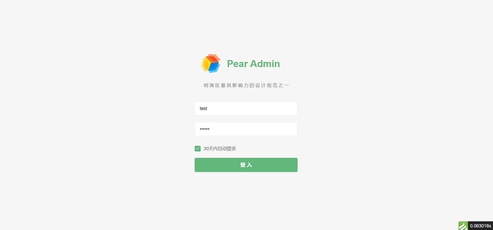  |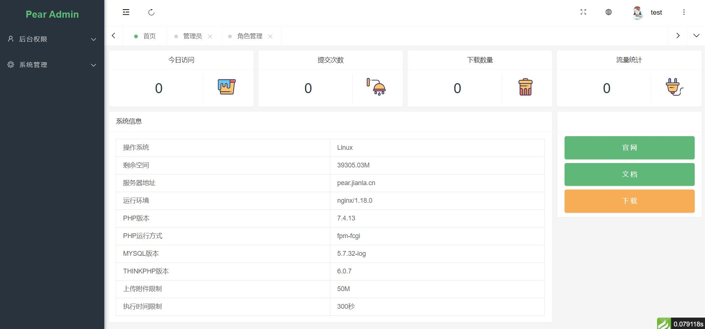  |
| 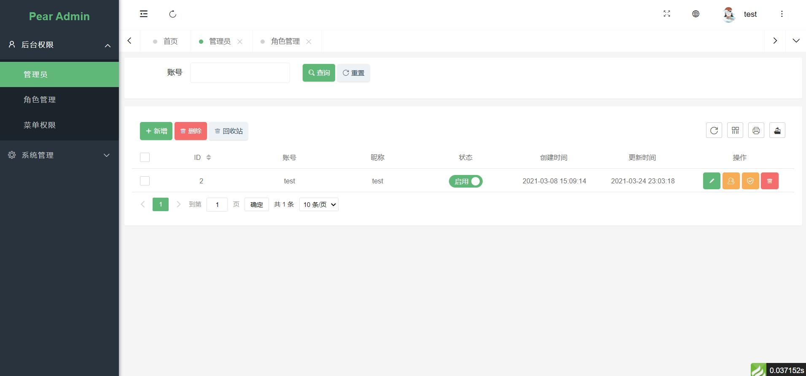|  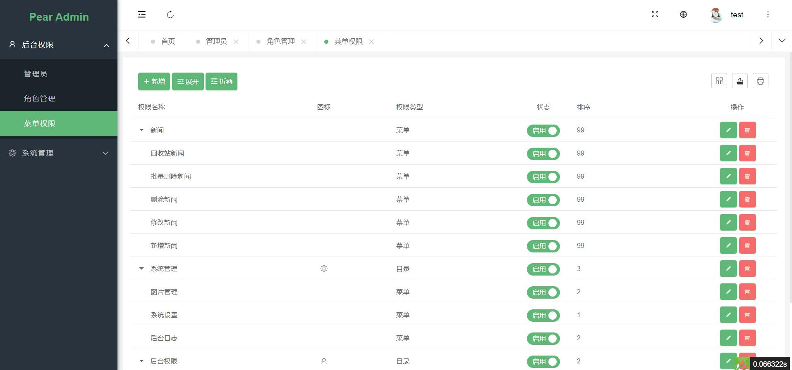   |
| 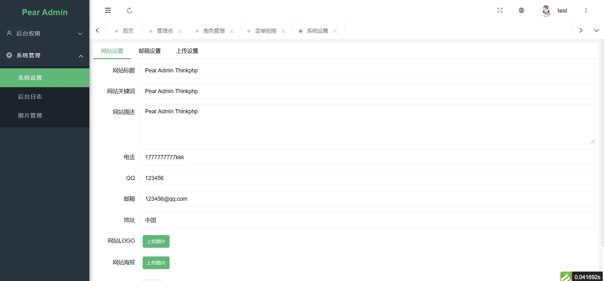|  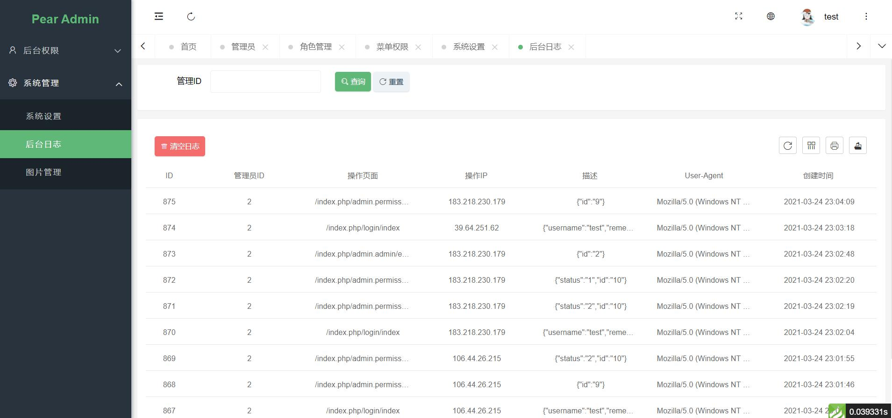  |
| 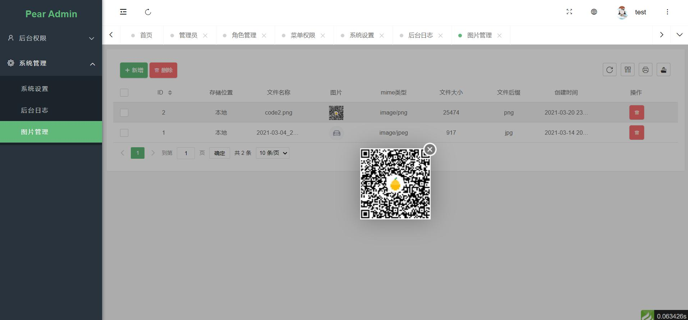|  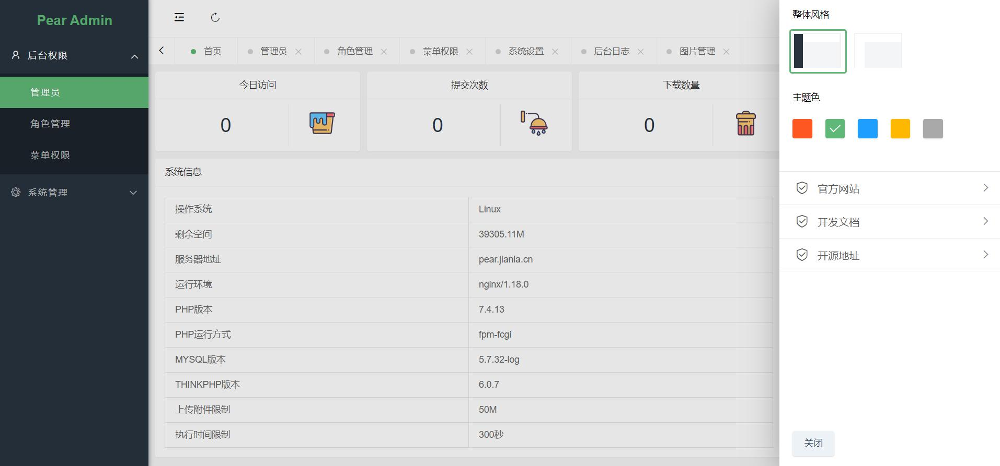   |
| 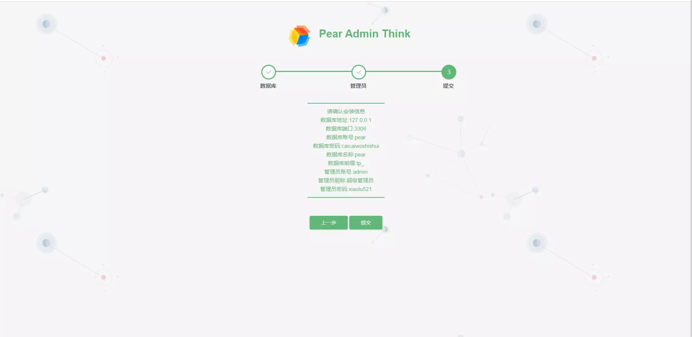|  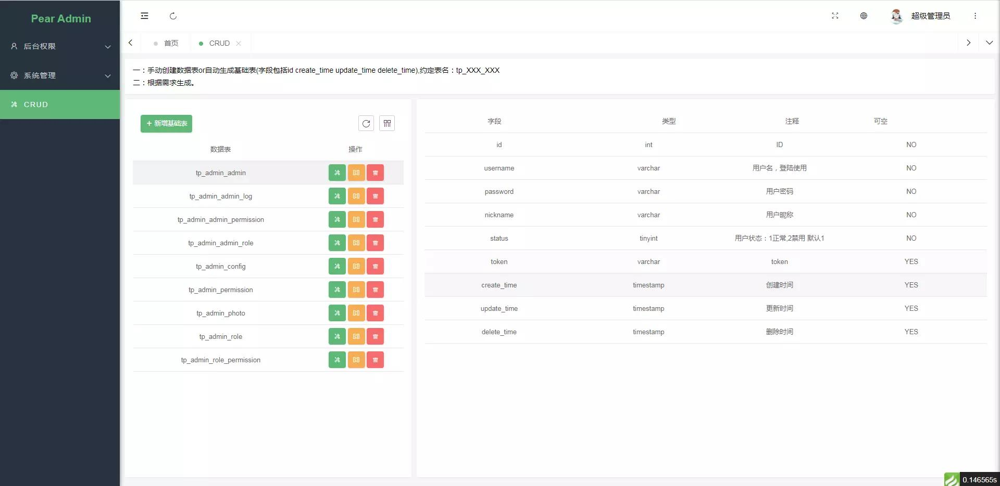  |
|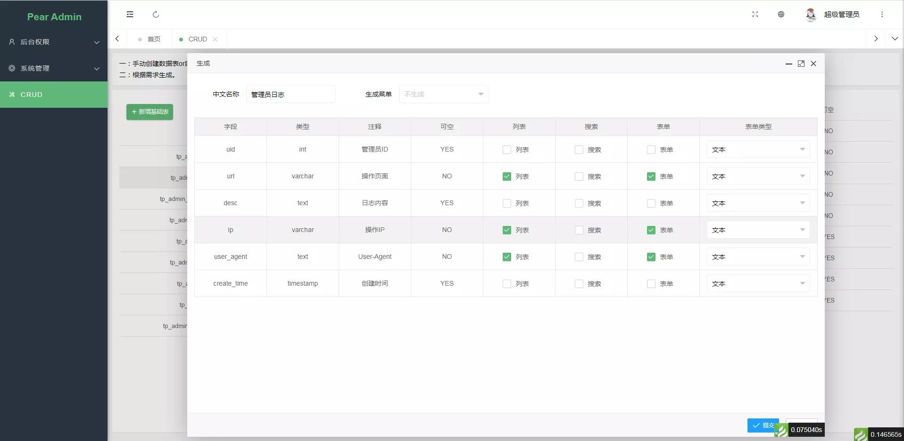| 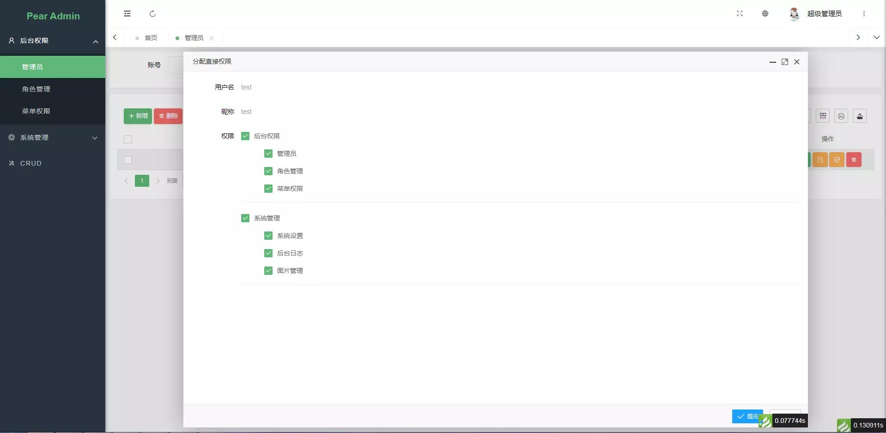   |